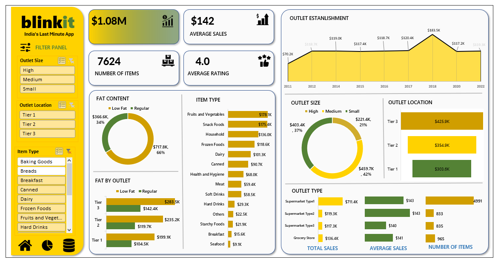

## 📊 Blinkit Sales Dashboard - Microsoft Excel Data Visualization Project  

An interactive and insightful dashboard built in **Microsoft Excel** to analyze Blinkit’s sales performance, customer satisfaction, and inventory distribution. This project demonstrates the application of data visualization techniques for better decision-making.  

### 📜 **Project Overview**  
The **Blinkit Sales Dashboard** provides an in-depth analysis of key business metrics, helping identify opportunities for growth and optimization.  

**Key Insights Explored:**  
✅ Total Sales: Overall revenue generated.  
✅ Average Sales: Revenue per sale.  
✅ Number of Items: Total count of different items sold.  
✅ Average Rating: Customer satisfaction score.  

### ✨ **Business Requirement**  
To evaluate Blinkit’s sales performance and optimize its strategies, various KPIs and data visualizations were used to uncover actionable insights.  

### **KPI Metrics:**  
- **Total Sales:** The revenue generated from items sold.  
- **Average Sales:** Revenue per transaction.  
- **Number of Items:** Count of items sold across categories.  
- **Average Rating:** Customer satisfaction measured through reviews.  

### **Visualization Goals:**  
1. **Total Sales by Fat Content:**  
   - **Objective:** Analyze the impact of fat content on sales performance.  
   - **Chart Type:** Donut Chart.  

2. **Total Sales by Item Type:**  
   - **Objective:** Evaluate item category performance.  
   - **Chart Type:** Bar Chart.  

3. **Fat Content by Outlet for Total Sales:**  
   - **Objective:** Compare sales across outlets based on fat content.  
   - **Chart Type:** Stacked Column Chart.  

4. **Sales by Outlet Establishment:**  
   - **Objective:** Assess the influence of outlet age/type on sales.  
   - **Chart Type:** Line Chart.  

5. **Sales by Outlet Size:**  
   - **Objective:** Determine how outlet size correlates with sales.  
   - **Chart Type:** Donut Chart.  

6. **Sales by Outlet Location:**  
   - **Objective:** Analyze geographic distribution of sales.  
   - **Chart Type:** Funnel Map.  

7. **All Metrics by Outlet Type:**  
   - **Objective:** Visualize all key metrics across outlet types.  
   - **Chart Type:** Matrix Card.  

### 🛠️ **Tools and Technologies Used**  
- **Microsoft Excel:** For building interactive dashboards.  
- **Data Analytics Techniques:** Structured raw data into actionable insights.  

### 🎯 **Project Objectives**  
1. Highlight trends and correlations in Blinkit’s sales data.  
2. Uncover areas for customer satisfaction improvement.  
3. Provide a decision-making tool for optimizing business operations.  

### 🖼️ **Dashboard Preview**  

### 🔍 **Insights Uncovered**  
📊 **Fat Content’s Influence:** Regular fat items contribute 66% of total sales.  
🌍 **Regional Sales:** Tier 3 outlets generate the highest revenue ($425.9K).  
🛒 **Best-Selling Item Types:** Fruits and Vegetables ($178K) and Snack Foods ($175.4K).  
🏢 **Outlet Size Performance:** Large outlets contribute 42% of total sales.  

### 📂 **How to Use the Dashboard**  
1. **Download the Repository:** Clone this repository or download the Excel file.  
2. **Open in Excel:** Load the dashboard file.  
3. **Explore the Data:** Use filters and visuals to analyze KPIs.  

### 🌟 **Why This Project Matters**  
This dashboard simplifies complex data into actionable insights. By using data visualization techniques, businesses can make informed decisions to drive growth and improve customer satisfaction.  

If you found this project useful, please ⭐ star this repository and share your feedback! 😊  
